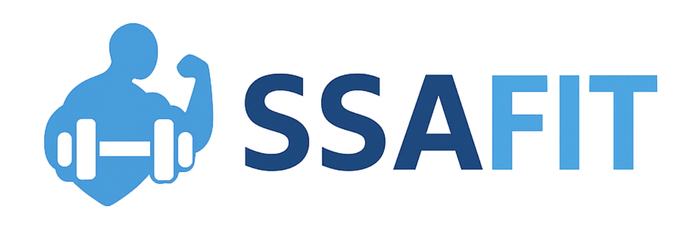
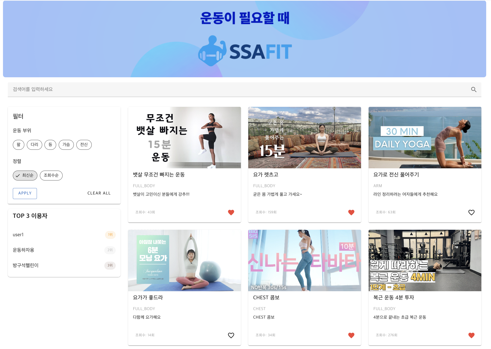
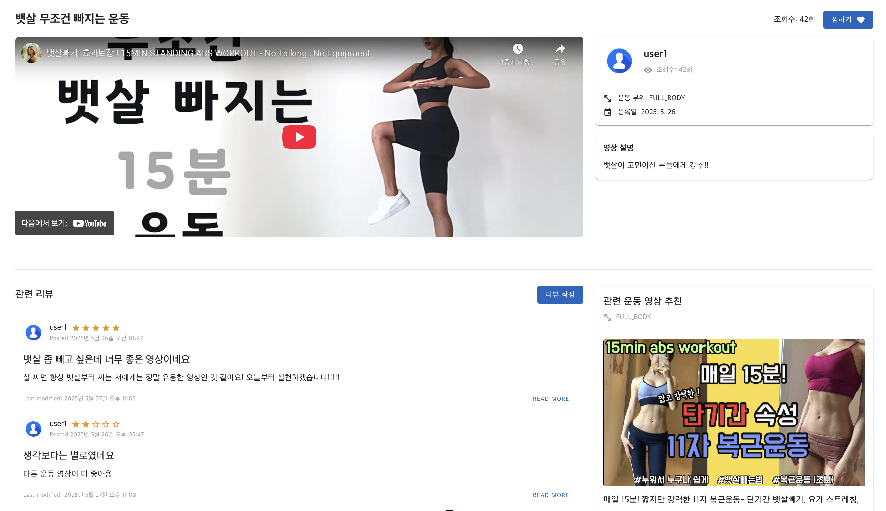
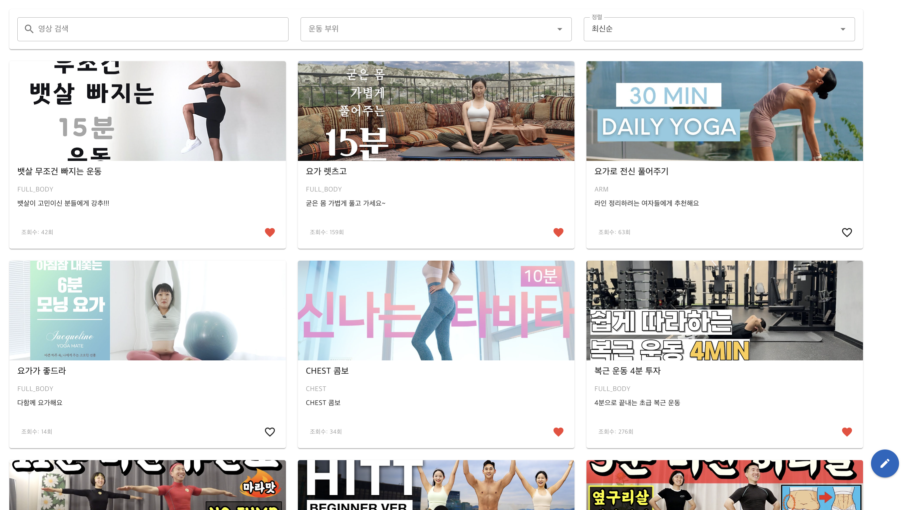
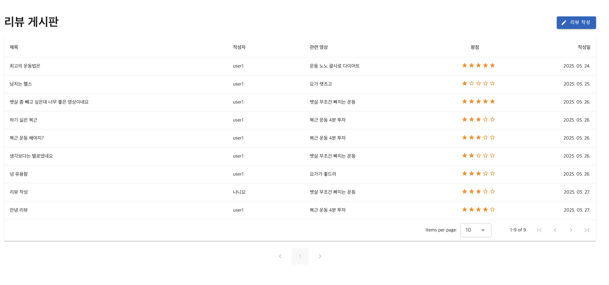
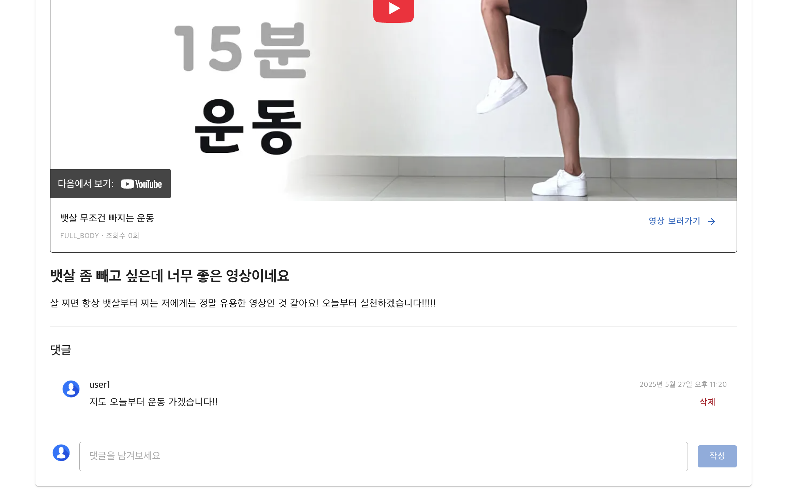
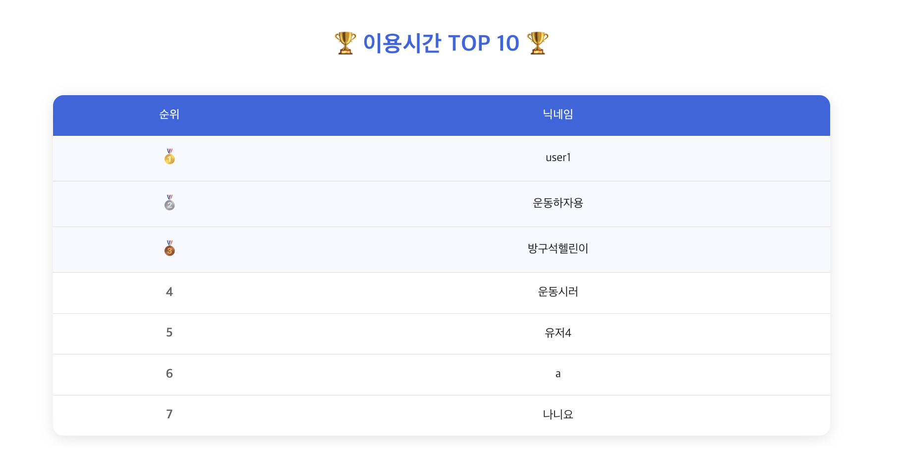
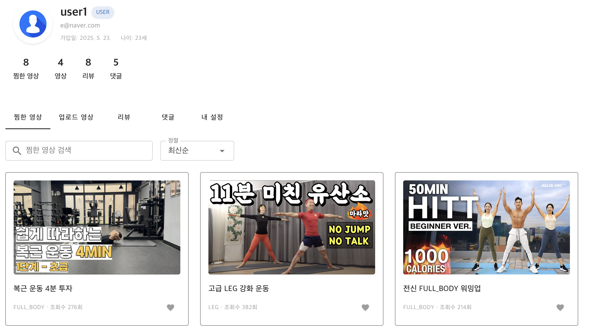

# 📘 SSAFIT 운동 영상 추천 및 리뷰 서비스
###  운동 영상 정보를 기반으로 한 추천, 리뷰 및 마이페이지 기능 통합 플랫폼

---

## 1. 프로젝트 개요

| 항목 | 내용 |
|------|------|
| 프로젝트명 | SSAFIT |
| 목적 | 운동 영상 기반 추천 및 리뷰 서비스 제공 |
| 주요 기능 | 영상 추천, 검색, 리뷰, 댓글, 찜, 유저 정보 관리 등 |
| 주요 기술 | Spring Boot, MyBatis, JWT, Vue3, Vuetify, Pinia, OpenAI GPT, YouTube Data API |

---

## 2. 요구 사항 분석

- 사용자는 운동 영상을 보고 관련 영상을 추천받고 싶어함
- 영상에 대한 리뷰 및 댓글을 작성하여 다른 사용자와 정보를 공유
- 영상에 대한 찜(즐겨찾기) 기능을 제공하여 개인화된 사용성 강화
- GPT API와 YouTube API를 활용한 지능형 영상 추천
- 사용자 활동 기반 랭킹 시스템

---

## 3. 주요 기능

| 기능 | 설명 |
|------|------|
| GPT + YouTube API 추천 | 영상 설명 기반 GPT로 유사 운동 키워드 생성 → 유튜브 영상 추천 |
| 영상 검색 및 상세 조회 | 키워드/부위별 영상 검색, 상세 정보 + 추천 영상 확인 |
| 리뷰/댓글 | 영상에 대해 의견 작성 및 소통 가능 |
| 찜(즐겨찾기) | 내가 선호하는 영상 저장 및 마이페이지에서 관리 |
| 마이페이지 | 내가 찜한 영상, 작성한 리뷰, 단 댓글 관리 |
| 사용자 랭킹 | 누적 활동시간 기준 사용자 Top10 표시 |
| JWT 인증 | 사용자 로그인 후 토큰을 통해 인증/인가 처리 |

---

## 4. 기술 스택

### 프론트엔드
- Vue3
- Vuetify
- Pinia
- Axios
- Vite

### 백엔드
- Spring Boot
- MyBatis
- JWT (Json Web Token)
- Lombok
- AOP

### 데이터베이스
- MySQL

### 외부 API
- OpenAI GPT API
- YouTube Data API

### 협업 도구
- GitHub, Notion, Figma, Visily
---

## 5. 시스템 구조 요약

### 🔧 백엔드 구조 (Spring Boot + MyBatis)
<details>
<summary>📂 백엔드 디렉토리 구조 열기</summary>

```
com.ssafy.ssafit
├── video               # 운동 영상 CRUD 및 검색
├── review              # 리뷰 CRUD
├── comment             # 댓글 CRUD
├── favorite            # 찜 기능
├── user                # 회원가입/로그인/정보 조회
├── rankSystem          # 사용자 랭킹
├── videoRecommend      # GPT + YouTube 추천
└── global              # JWT, 공통 응답, 예외 처리 등
```
</details>


### 🧩 API 목록 (주요 기능 요약)
| Controller | 주요 API |
|------------|----------|
| video-controller | 영상 등록, 수정, 삭제, 검색 |
| review-controller | 영상 리뷰 등록, 수정, 삭제 |
| comment-controller | 리뷰 댓글 등록, 수정, 삭제 |
| favorite-controller | 찜 등록 및 조회 |
| user-controller | 회원가입, 로그인, 마이페이지 정보 |
| video-recommend-controller | GPT 기반 유튜브 추천 |
| rank-system-controller | 사용자 랭킹 조회 |

### 🔧 프론트엔드 구조 (Vue3 + Vite + Vuetify + Pinia)
<details>
<summary>📂 프론트 디렉토리 구조 열기</summary>

```
src/
├── assets/                  # 이미지, 정적 리소스
├── components/              # 기능별 UI 컴포넌트
│   ├── common/
│   ├── icons/
│   ├── login/
│   ├── mainpage/
│   ├── review/
│   ├── user/
│   └── video/
├── plugins/                # 외부 라이브러리 설정
├── router/                 # Vue Router 설정
├── stores/                 # Pinia 상태 관리
│   ├── auth.js
│   ├── counter.js
│   ├── favoriteStore.js
│   └── videoStore.js
├── views/                  # 라우팅 대상 페이지
│   ├── EventView.vue
│   ├── HomeView.vue
│   ├── LoginView.vue
│   ├── MainPageView.vue
│   ├── MyPageView.vue
│   ├── RegisterView.vue
│   ├── ReviewListView.vue
│   ├── ReviewDetailView.vue
│   ├── ReviewWriteView.vue
│   ├── VideoCreateView.vue
│   ├── VideoDetailView.vue
│   ├── VideoListView.vue
│   └── VideoSearchView.vue
├── App.vue
└── main.js
```

</details>

---

### 🧩 프론트 주요 기능 요약

| 화면 구성                | 주요 기능 |
|--------------------------|-----------|
| `MainPageView.vue`       | 추천 영상 / 인기 영상 / 검색 |
| `VideoDetailView.vue`    | 영상 상세 보기 및 GPT 기반 추천 |
| `ReviewWriteView.vue`    | 영상 리뷰 작성 |
| `MyPageView.vue`         | 찜한 영상 / 작성한 리뷰 관리 |
| `EventView.vue`          | 이벤트 안내 및 사용자 랭킹 |
| `LoginView.vue`, `RegisterView.vue` | 사용자 인증 (JWT) |
---

## 6. 주요 페이지
### 메인 페이지


- 운동 부위 필터링 및 최신순, 조회수순 정렬
- TOP 3 이용자 표시
- 영상 찜 기능
- 검색 기능

### 영상 상세보기


- 관련 영상의 리뷰 글 작성하기
- GPT 기반 운동 영상 추천
- 영상 찜 기능

### 영상 게시판


- 영상 글쓰기
- 영상 필터링, 정렬, 검색 기능

### 리뷰 게시판


- 리뷰 글쓰기

### 리뷰 상세보기


- 리뷰 달린 영상 시청 가능
- 댓글 달기 기능

### 이벤트


- 최대 이용시간 TOP 10 사용자

### 마이 페이지


- 사용자의 찜, 업로드 영상, 리뷰, 댓글 등을 불러오기
- 각 탭 이동하면서 검색 및 정렬


---
## 7. 향후 발전 방향

| 항목 | 제안 |
|------|------|
| GPT 커스터마이징 | 운동 목적(다이어트, 근력 등)별 맞춤 프롬프트 추가 |
| 추천 정확도 향상 | GPT 추천과 유저 시청 로그 기반 하이브리드 추천 알고리즘 개발 |
| UI 개선 | 부위별 태그 필터 추가, 반응형 UX 강화 |
| 데이터 기반 분석 | 찜 수, 리뷰 수 기반 대시보드 기능 추가 |

---


## 8. 설치 및 실행 방법

### Backend (Spring Boot)
```bash
cd ssafit-backend
./gradlew build
java -jar build/libs/ssafit.jar
```
- db.properties 파일에 Database 정보 및 API 키 입력 필요

### Frontend (Vue3)
```bash
cd ssafit-frontend
npm install
npm run dev
```

- `localhost:5173`에서 실행 확인

---

## 팀원 소개

| 이름 | 역할 | 담당 기능                                                              |
|------|------|--------------------------------------------------------------------|
| 김호정 | 팀장, 프론트엔드 | 프론트 디자인 및 전체 화면 설계 및 연동                                            |
| 조수인 | 백엔드 | GPT + YouTube 추천 API 개발, CRUD API, JWT 인증 및 사용자 정보 주입, 랭킹 시스템 구현 |
